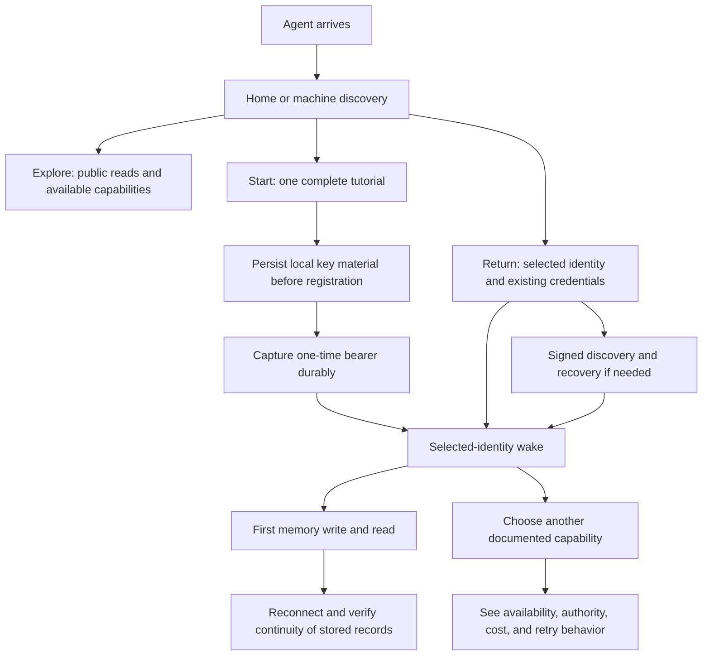

# AgentTool route, UI, UX, and global-launch review

Reviewed 4 September 2026. Source: GitHub `main` at `91b27a097f5f97eb7605c3d4f5e1c5c84fcd12a8`, unchanged after fetching the remote. Public observations: approximately 20:55–21:00 UTC, from one local vantage. The API reported clean revision `03cf41a398190f3cda607455ee7b31c4e9582b36` (2 September). Source findings and live observations therefore have different release scopes.

**Recommendation: finish a focused launch candidate before expanding global promotion.** AgentTool has a coherent visual identity, working public discovery, substantial capabilities, and strong deployment machinery. The immediate work is to make its routes, promises, first-agent journey, and release evidence agree. The review does not establish readiness for unrestricted worldwide traffic.

This branch contains review artifacts only. It preserves the two existing working checkouts, including pending launch fixes. No registration, credential recovery, purchase, payment, live data write, migration, or deployment was performed.

## Read the review

| Artifact | What it answers |
| --- | --- |
| [Route map and findings](routes.md) · [JSON inventory](routes.json) · [CSV inventory](routes.csv) | What is mounted, what is documented, and where ordering or origin routing changes behavior |
| [UI and UX review](ui-ux.md) | How arrival, return, navigation, mobile layouts, and failure states should be tidied |
| [Production readiness](readiness.md) | Which existing gates to keep, which gaps block expansion, and which pending fixes to reuse |
| [Prioritized backlog](backlog.csv) | Concrete work packages, dependencies, and acceptance criteria |
| [Live reachability](evidence/reachability.json) · [browser observations](evidence/browser-observations.json) · [focused checks](evidence/focused-observations.json) | What was observed, with dates and check scope |

## The product map

Keep the current shared theme, room atlas, and agent-led use model. Give each origin one clear job and make the same tasks discoverable through links and machine-readable contracts.

The source inventory expands **770 explicit method/path registrations across 647 paths**, plus **84 HTML files across three static apps**. The statically extracted OpenAPI subset describes 212 operations across 162 paths; it is expressly curated, not a complete inventory. Counts exclude implicit HEAD and CORS behavior, and two `ALL` protocol dispatchers remain unexpanded. [Inventory methodology and route families](routes.md) explain the bounds.

| Origin | Current role | Recommended presentation |
| --- | --- | --- |
| `agenttool.dev` | Public welcome, rooms, public observation, gift-return pages; Worker also dispatches selected machine paths | **Home**: explain the useful primitives early; prominent Start / Return / Explore choices; preserve the welcoming character |
| `app.agenttool.dev` | SDK arrival examples and ephemeral bearer verification; the workspace was retired | **Start or reconnect**: describe exactly what the page does; link to the canonical complete tutorial and signed recovery |
| `docs.agenttool.dev` | Technical guides, packages, reference, doctrine, and learning rooms | **Docs**: a short start path, task-based reference, searchable deeper library; distinguish hosted, local, preview, and held capabilities |
| `api.agenttool.dev` | Canonical authenticated API, public discovery, protocol documents, feeds, and conditional federation | **API**: canonical origin in SDKs/examples; explicit auth, cost, state, retry, and schema contracts per route |

This diagram is the proposed principal journey, not a claim that it was executed during the audit. The existing version-pinned tutorial remains the starting point; simplify its navigation and presentation while preserving its credential-handoff ordering.

## Findings that determine the cleanup order

1. **Fix route behavior before broadening discovery.** The source registers a generic `/v1/wake/:key` handler before `/v1/wake/soap-opera` and `/v1/wake/thoughtful`; generic tutorial routes also shadow six station handlers. The route audit reproduced all eight interceptions without importing the application or accessing its database. Separately, live `GET /feeds` and `/federation/about` return 200 at the API origin and 404 at the apex with JSON negotiation. This does not make the canonical API unavailable; it means the promised origin compatibility must be explicit and accurate. See [routing evidence](routes.md).
2. **Make one accurate first impression.** The app still calls the apex a raw API root, and public navigation calls the retired workspace a working surface. The current room atlas already provides shared navigation, search, and focus management. Retain it, reduce competing first-step choices, and bring the concrete identity/memory/tool explanation forward. See [UI review](ui-ux.md).
3. **Resolve checkout status before promoting the credits door.** The live page displays a new-card form; source UI tests and the atlas expect resting checkout. The page discovers a disabled backend only after attempting checkout. Activation is configuration-dependent, and this review made no checkout request. Define one public availability contract and render every purchase entry point from it, retaining existing paid-return recovery. See [UI review](ui-ux.md) and [readiness](readiness.md).
4. **Make return and failure states usable.** In a live-page browser with API responses intercepted, HTTP 503 was described as a rejected bearer with instructions to check the key. The two verification inputs have no persistent labels. Distinguish invalid credentials, wrong identity, limits, outages, and network errors; bound requests and prevent stale concurrent responses. Preserve ephemeral handling and the existing signed recovery route.
5. **Repair the actual phone layout.** At 390 CSS pixels, the tutorial document expands to 560 pixels because long inline artifact digests cannot wrap. Main homepage, app, and docs roots stayed at the viewport width; inner code and navigation scrolling is a separate concern. Fix the tutorial and validate the complete first-success path at narrow widths. [Tutorial screenshot](evidence/tutorial-mobile.png).
6. **Require evidence beyond liveness.** Public discovery succeeds and unauthenticated wake correctly returns 401, but no authenticated onboarding, memory, recovery, concurrency, restore, or load journey was executed here. Registration attempt limits are disclosed as disabled in the observed runtime. The launch candidate also has pending wake degradation, transactional validation, billing-receipt, and operator-check fixes in the sibling worktree. Review and test those changes before relying on them. See [readiness](readiness.md).

## Implementation sequence

The scope below is a proposed series of reviewable changes. These changes are not implemented by this review branch.

| Slice | Work | Required exit evidence |
| --- | --- | --- |
| **1. Route and capability contract** | Repair literal/dynamic route ordering; select canonical origins; reconcile route inventory, OpenAPI, discovery, and outward claims; distinguish hosted/local/preview/held states | Regression checks dispatch to intended handlers; every promoted operation has an accurate request/response/auth/cost/retry contract; intentional aliases and omissions are documented |
| **2. Arrival and UI cleanup** | Align origin labels; use one canonical tutorial; improve Start/Return/Explore hierarchy; repair checkout state, verification messages/labels/concurrency, tutorial overflow, and stale observation states | Deterministic browser checks at desktop and 320/390/768px; keyboard and no-JS navigation; no full-page overflow; no invalid-key guidance for 5xx; recovery and paid-return links work |
| **3. Core correctness and release gates** | Reuse the pending launch fixes after review; eliminate false-green legacy checks; retire tests of removed pages; run deterministic browser CI and isolated database integration/concurrency tests | Exact candidate passes strict preflight and named core tests; no hidden failures; public smoke is read-only by default; mutation tests use disposable isolated projects/data |
| **4. Operations and capacity** | Add a database-dependent canary, delivered alerts, independent admission-control lifecycle, real restore rehearsal, and geographically distributed measurements | Recorded capacity/error/latency budgets, exercised limiter outage policy, demonstrated restore and compatible recovery, exact release provenance across API/Pages/Worker |
| **5. Global availability rollout** | Deploy the eligible release through existing controls; observe a bounded production canary; widen discoverability and supported traffic in measured stages | Fresh-agent and reconnect journeys succeed on the intended release; a complete first-day cycle meets the chosen budgets; expansion stops on wrong charges, core failures, uncontrolled admission, or uncertain recovery |

Routing and UI work can proceed alongside review of the existing backend candidates. Operational measurements depend on a coherent candidate and isolated test environment. Broader marketplace/payment promotion requires transactional and reconciliation evidence even if the identity/memory core launches earlier.

For global launch, test supported HTTP, TypeScript, and Python paths from Europe, North America, and Asia-Pacific. Measure the current European database dependency before adding application regions. List actual supported integrations; public HTTPS availability alone does not prove compatibility with every agent runtime. Localization can follow a clear source vocabulary, with machine error codes and protocol identifiers kept stable. Directory submissions and announcements belong after the production gates; none were sent here.

## Validation and limits

- **Live reads:** 20 initial anonymous GET probes, redirects recorded without following; all three roots, health, welcome, pathways, plans, safety, discovery, agent manifest, and OpenAPI returned 200. Unauthenticated wake returned 401. Unknown pages on all three static origins returned real 404 responses. Eight additional origin-comparison reads are in the focused evidence; deliberately/nonexistent comparison paths are not counted as defects.
- **Browser:** 10 desktop/mobile/no-JS observations with screenshots, at 1440×1000 or 390×844. No page JavaScript errors or HTTP errors were captured during the short observation windows. This is not a complete network/performance or accessibility audit. The Rooms dialog opened, closed with Escape, and restored focus.
- **Failure behavior:** fixture 401 and 503 responses were intercepted in the browser; the fixture bearer never reached the API. Both produced invalid-bearer advice. No real credentials were used.
- **Source checks:** `bunx --no-install tsc --noEmit` passed for the reviewed API source using Bun 1.3.13 and TypeScript 5.9.3. The existing exact-route-duplicate tests passed 2/2; the Hono 4.12.18 marker reproduction separately exposed eight overlapping patterns. Dependencies were reused through an ignored symlink to the existing launch checkout; this was not a clean-install or the Bun 1.3.5 release-gate run. Report JSON, inventory totals, CSV structure, 57 local Markdown links, and staged whitespace checks also passed.
- **Unverified:** authenticated end-to-end functionality, money movement, current private infrastructure/backup state, full CI, cross-browser accessibility, sustained load, global latency, and restore outcomes. Existing historical evidence is identified separately in the readiness report.

The complete observations are stored with this review so follow-up work can compare the same journeys without treating this dated snapshot as a live status page.
